<p align="center"></p>

# Fabric-SDK

**Stop paying Claude to answer questions your own systems already know.**

The fabric ecosystem — git, k8s, aiana, sandfly, cloudflare, proxmox, tailscale, unifi, chat, and cve — has accumulated a significant knowledge base across Qdrant collections, Redis state, and indexed outcomes. Every time Claude is asked something that's already in that knowledge base, API credits are burned for what is essentially a lookup operation.

The Fabric-SDK is the routing layer that makes that decision: does the fabric already know this, or does it genuinely need Claude? BGP-style routing, three-lane path selection, unicast DNS resolution — all in service of one thing: Claude only gets called when nobody else can answer.

The system gets smarter over time. Every time Claude does get called, AIANA indexes the outcome. Next time the same pattern comes up, it routes locally. The Claude escalation rate trends toward zero for known problem domains.

## Network Topology

Each fabric is a self-contained autonomous system — MCP server, AIANA memory, local LLM, and workers. Fabrics operate independently. The gateway is optional connective tissue for cross-fabric resolution; it is not a dependency.

```
                    Claude (eBGP upstream / AS65000 / transit provider)
                       |
                  +----+----+
                  | Firewall| (L2 — policy enforcement / prefix binding / injection detection)
                  +----+----+
                       |
    +------------------+------------------+
    |          Gateway (Route Reflector)   |
    |   - Fabric RIB (F-RIB)             |
    |   - Interceptor (path selection)    |
    |   - DNS (unicast resolution)        |
    |   - Metrics (/metrics)              |
    |   - Audit log (Redis-backed)        |
    +--------+----------+----------+------+
             |          |          |
    +--------+--+ +-----+----+ +--+--------+
    | Fabric    | | Fabric   | | Fabric    |  (autonomous systems)
    | git       | | k8s      | | sandfly   |
    | AS65001   | | AS65003  | | AS65006   |
    |           | |          | |           |
    | +-------+ | | +------+ | | +-------+ |
    | | MCP   | | | | MCP  | | | | MCP   | |
    | +-------+ | | +------+ | | +-------+ |
    | | AIANA | | | | AIANA| | | | AIANA | |
    | +-------+ | | +------+ | | +-------+ |
    | | Ollama| | | |Ollama| | | |Ollama | |
    | +-------+ | | +------+ | | +-------+ |
    +-----------+ +----------+ +-----------+
```

## Routing Example

```
worker finds CVE in a dependency
  -> reports to git fabric (internal, no routing needed)
  -> git fabric checks local Ollama + AIANA memory
      -> known pattern? resolve locally, worker executes
      -> unknown? git fabric queries gateway DNS
          -> gateway checks F-RIB
              -> another fabric knows? unicast to that fabric
              -> nobody knows? default route -> Claude
  -> resolution flows back to worker
  -> AIANA indexes the outcome (if Claude was called)
  -> next time, it routes locally
```

## OSI Model

```
Layer 7 — Application    | Fabric apps (git, k8s, sandfly, cloudflare, etc.)
Layer 6 — Presentation   | MCP protocol (serialization, schema, tool contracts)
Layer 5 — Session        | AIANA (conversation state, memory continuity)
Layer 4 — Transport      | Interceptor + DNS resolver (routing decisions, unicast dispatch)
Layer 3 — Network        | Gateway (topology, fabric registry, resolution cache)
Layer 2 — Data Link      | Firewall (prefix binding, prompt injection, PII scrubbing)
Layer 1 — Physical       | Tailscale (zero-trust transport, k3s mesh)
```

Claude is `0.0.0.0/0` — the default route with lowest local preference.

## Routing Lanes

| Lane | Condition | Handler |
|------|-----------|---------|
| `deterministic` | confidence >= 0.95 | Direct tool execution, no LLM needed |
| `local-llm` | confidence >= floor (0.7) | Fabric's Ollama instance (CPU, quantized 3B–7B) |
| `claude` | confidence < floor | Claude API via gateway (with context injected) |

## Fabric Ecosystem

All fabric apps follow a shared convention: `src/app.ts` (FabricApp), `src/adapters/env.ts` (createAdapterFromEnv), `bin/cli.js` (stdio MCP entry), TypeScript ESM.

| Repo | Description | Visibility |
|------|-------------|------------|
| [git-fabric/git](https://github.com/git-fabric/git) | Git operations — commit, push, branch, PR, repo management | Public |
| [git-fabric/k8s](https://github.com/git-fabric/k8s) | Kubernetes operations — cluster, pods, deployments, services, logs | Public |
| [git-fabric/aiana](https://github.com/git-fabric/aiana) | Semantic memory — session context, cross-project recall | Public |
| [git-fabric/sandfly](https://github.com/git-fabric/sandfly) | Sandfly Security — agentless Linux intrusion detection | Public |
| [git-fabric/cloudflare](https://github.com/git-fabric/cloudflare) | Cloudflare — DNS, zones, cache, KV | Public |
| [git-fabric/proxmox](https://github.com/git-fabric/proxmox) | Proxmox VE — VMs, containers, nodes, storage, snapshots | Public |
| [git-fabric/tailscale](https://github.com/git-fabric/tailscale) | Tailscale — devices, DNS, ACL, auth keys | Public |
| [git-fabric/unifi](https://github.com/git-fabric/unifi) | UniFi — hosts, sites, devices via UI.com Cloud API | Public |
| [git-fabric/chat](https://github.com/git-fabric/chat) | Chat — AI conversation sessions, semantic history search | Public |
| [git-fabric/cve](https://github.com/git-fabric/cve) | CVE — scan, enrich, triage, and fix vulnerabilities | Public |
| [git-fabric/gateway](https://github.com/git-fabric/gateway) | Gateway — routes, connects, and orchestrates fabric apps | Public |
| [git-fabric/terminal](https://github.com/git-fabric/terminal) | Terminal — Claude Code + tmux + kubectl in a container | Public |
| [git-fabric/pipelines](https://github.com/git-fabric/pipelines) | Pipelines — automated fabric workflows | Private |
| [git-fabric/fabric-forge](https://github.com/git-fabric/fabric-forge) | Forge — k3s cluster + Helm charts, one script full stack | Private |
| git-fabric/sdk | SDK — this repo (routing layer, F-RIB, firewall, DNS) | Private |

## SDK Packages

| Package | Description |
|---------|-------------|
| [`@fabric-sdk/gateway`](packages/gateway) | BGP-style route reflector. F-RIB, unicast DNS resolver, interceptor, firewall, metrics, audit. |
| [`@fabric-sdk/client`](packages/client) | Client library for fabrics. Registration, keepalive, intercept, Ollama integration. |
| [`create-fabric-app`](packages/create-fabric) | CLI to scaffold a new fabric project with templates. |
| [`@fabric-sdk/fabric-aiana`](packages/fabric-aiana) | Semantic memory fabric. Qdrant-backed, OpenAI embeddings, SDK-native AIANA. |

## Deployment

Deploy the full stack with [fabric-forge](https://github.com/git-fabric/fabric-forge):

```bash
git clone https://github.com/git-fabric/fabric-forge
cd fabric-forge
bash forge.sh
```

Provisions k3s (k3d on macOS, bare-metal on Linux) and deploys Ollama, Redis, fabric-gateway, and fabric-aiana via Helm charts. See the [fabric-forge README](https://github.com/git-fabric/fabric-forge#readme) for secrets setup and configuration.

**Build (gateway):**

```bash
make build-gateway TAG=0.1.8
make deploy-gateway TAG=0.1.8
```

All builds enforce `--platform linux/amd64`. Image tags are immutable — once pushed, never overwritten.

## Gateway Endpoints

| Method | Path | Description |
|--------|------|-------------|
| GET | `/health` | Gateway health + fabric/route counts |
| GET | `/frib` | Full F-RIB + session table |
| GET | `/frib/route/:prefix` | Single prefix lookup |
| GET | `/metrics` | Intercept counts by lane, Claude avoidance rate, DNS cache ratio |
| GET | `/audit` | Persistent audit log |
| POST | `/register` | Fabric registration (ADR-002 S7) |
| POST | `/keepalive` | Fabric keepalive with route self-healing (ADR-002 S11) |
| POST | `/withdraw` | Route withdrawal |
| POST | `/advertise` | New route advertisement |
| POST | `/dns/resolve` | Unicast DNS resolution (ADR-002 S12) |
| POST | `/intercept` | Full path selection (firewall -> DNS -> lane) |

## ADRs

Architecture and governance decisions live in [`adr/`](adr/):

| ADR | Scope |
|-----|-------|
| [ADR-001](adr/ADR-001-fabric-sdk-architecture.md) | Framework architecture, OSI mapping, BGP routing model |
| [ADR-002](adr/ADR-002-worker-contract-registration.md) | Worker contract, fabric registration protocol, F-RIB spec |
| [ADR-003](adr/ADR-003-guardrails.md) | Development guardrails, secure agent architecture, cost controls |

AI-specific governance in [`adr/ai/`](adr/ai/), aligned with OWASP LLM Top 10, NIST AI RMF, and ISO 42001:

| AI-ADR | Coverage |
|--------|----------|
| [AI-ADR-001](adr/ai/AI-ADR-001-secure-use-of-external-llms.md) | Secure use of external LLMs |
| [AI-ADR-002](adr/ai/AI-ADR-002-prompt-injection-mitigation.md) | Prompt injection mitigation |
| [AI-ADR-003](adr/ai/AI-ADR-003-ai-data-classification-redaction.md) | AI data classification and redaction |
| [AI-ADR-004](adr/ai/AI-ADR-004-llm-output-validation.md) | LLM output validation |
| [AI-ADR-005](adr/ai/AI-ADR-005-ai-logging-monitoring.md) | AI logging and monitoring |
| [AI-ADR-006](adr/ai/AI-ADR-006-agent-permission-boundaries.md) | Agent permission boundaries |
| [AI-ADR-007](adr/ai/AI-ADR-007-vector-database-security.md) | Vector database security |
| [AI-ADR-008](adr/ai/AI-ADR-008-ai-model-access-control.md) | AI model access control |
| [AI-ADR-009](adr/ai/AI-ADR-009-ai-vendor-approval.md) | AI vendor approval process |
| [AI-ADR-010](adr/ai/AI-ADR-010-ai-incident-response.md) | AI incident response procedures |
| [AI-ADR-011](adr/ai/AI-ADR-011-development-compliance.md) | Development compliance — change requests, PRs, deployment |

## Enforcement (Validated)

The following enforcement mechanisms are tested and operational (26/26 checks passing):

- **Prefix binding** — fabrics can only advertise prefixes within their declared `fabric.*` domain
- **Prompt injection detection** — multi-pattern regex firewall at L2
- **PII scrubbing** — SSN, credit card, email patterns stripped before Claude escalation
- **Persistent audit log** — every intercept, registration, and DNS resolution logged to Redis
- **Metrics endpoint** — Claude avoidance rate, lane distribution, DNS cache ratio
- **Route self-healing** — keepalive re-inserts expired routes from session state (DNS-001)
- **DNS cache flush** — stale cache cleared on gateway startup (DNS-002)
- **Immutable image tags** — Makefile enforces `--platform linux/amd64`, no tag overwrites
- **Branch protection** — no force push, no branch deletion on main (12 public repos)

## Project Status

| Phase | Status |
|-------|--------|
| Phase 1 — Spec | Complete (ADR-001, ADR-002) |
| Phase 2 — Scaffold | Complete (gateway, client, create-fabric, fabric-aiana) |
| Phase 3 — Validate | Complete (26/26 enforcement checks, 84.9% Claude avoidance rate) |
| Phase 4 — Harden | Up next (automated CI, threshold tuning, alerting) |

## Development

```bash
npm install
npm run build
npm test
```

All changes follow the [development compliance process](adr/ai/AI-ADR-011-development-compliance.md): Document -> Branch -> Implement -> Test -> PR -> Approve -> Build -> Deploy -> Verify.

## License

MIT

<!-- org-footer -->
---

<p align="center"><sub>Part of <a href="https://github.com/git-fabric">git-fabric</a> · composable fabric apps for Git-native infrastructure · built by <a href="https://github.com/ry-ops">ry-ops</a></sub></p>
